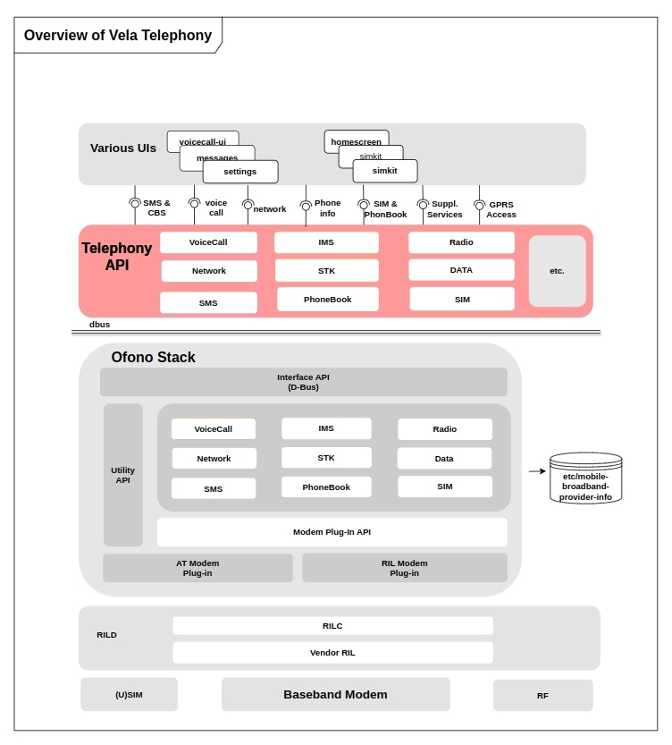
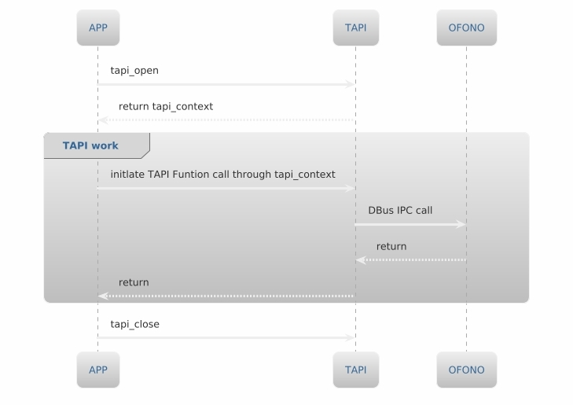

# Telephony Documentation

[English|[简体中文](./README_zh-cn.md)]

## **Overview**

Telephony is a framework and API set for handling phone and communication functions in the `openvela` operating system. `Framework/telephony` is the interface layer provided by `openvela` communication to the application layer, also known as `TAPI (Telephony API)`.

`TAPI` provides a set of feature-rich tools and interfaces, covering network services, call services, SMS services, data services, SIM card services and other related functions. These interface designs allow application developers to easily obtain information related to Telephony and complete application development by calling `API` without having to deeply understand the internal business logic of Telephony (Telephony internal business is implemented by `Ofono`). In addition, Telephony also supports flexible expansion and customization to meet changing communication needs.



## **Code Directory**
```tree
├── include
│   ├── tapi_call.h
│   ├── tapi_cbs.h
│   ├── tapi_data.h
│   ├── tapi.h
│   ├── tapi_ims.h
│   ├── tapi_manager.h
│   ├── tapi_network.h
│   ├── tapi_phonebook.h
│   ├── tapi_sim.h
│   ├── tapi_sms.h
│   ├── tapi_ss.h
│   └── tapi_stk.h
├── src
│   ├── tapi_call.c
│   ├── tapi_cbs.c
│   ├── tapi_data.c
│   ├── tapi_ims.c
│   ├── tapi_manager.c
│   ├── tapi_network.c
│   ├── tapi_phonebook.c
│   ├── tapi_sim.c
│   ├── tapi_sms.c
│   ├── tapi_ss.c
│   ├── tapi_stk.c
│   └── tapi_utils.c
├── tools
│   └── telephony_tool.c
├── README.md
└── README_zh-cn.md
```

## **Module Introduction**

| Module     | File  | explain      |
| :------ | :------- | :--------- |
| Common | tapi_manager.c/h  | <div style="width: 2000pt">Telephony public service interface |
| Call | tapi_call.c/h | Call service interface|
| Call | tapi_ss.c/h | Call supplementary service interface|
| Network | tapi_network.c/h | Network service interface |
| Data | tapi_data.c/h | Data service interface  |
| SIM | tapi_sim.c/h  |SIM service interface|
| STK | tapi_stk.c/h  |STK service interface|
| SMS | tapi_sms.c/h | SMS service interface |
| IMS | tapi_ims.c/h | IMS service interface  |
| Phonebook | tapi_phonebook.c/h | Phonebook interface  |
| <div style="width: 120pt">Telephony Utils| tapi_utils.c/h |Telephony util interface |
| Telephony Tools| telephony_tool.c | Telephony internal interface test  |

### **Function Introduction**

#### Common Api
- Telephony service interface: provides an interface for obtaining and releasing Telephony services.
- Obtain communications equipment related information: such as `IMEI`, `MODEL`, `MSISDN`, `PhoneNumber`, `Modem` parameters, etc.
- Communication capability management: turn on/off flight mode, turn on/off cellular communication capability, etc.

#### Call Api
- Call status monitoring: monitor/unmonitor call status and obtain current call status (OFF-HOOK, InComing, Idle).
- Call service support: support functions such as answering incoming calls, making calls, multi-way call switching, hanging up calls, etc.
- Emergency number management: obtain all current emergency numbers and determine whether the current number is an emergency number.

#### Call SS Api
- Supplementary service support: including call forwarding, call waiting, call restriction, hiding the calling number, hiding the other party's number, etc.

#### Network Api
- Network status monitoring: monitor/unmonitor network status and obtain detailed information of voice/data network.
- Roaming control: determine whether to roam and the type of roaming (domestic roaming/international roaming).
- Cell information management: obtain information of resident cells, neighboring cells, etc.

#### Data Api
- Data status monitoring: monitor/unmonitor data services and obtain whether the data is connected.
- APN management: load APN, add APN, remove APN, reset APN, etc.
- Data service control: turn on or off cellular data, data roaming, etc.

#### SIM Api
- SIM status monitoring: monitor/unmonitor and obtain SIM card status.
- Obtain SIM card related information: such as ICCID, SIM card provider, PIN code, etc.
- SIM card settings: obtain and set the SIM card enable/disable status.

#### STK Api
- Register STK agent: used for interaction during SIM initialization.
- Get STK information: such as STK main menu items, STK main menu title, STK text content, etc.
- User operation management: request the user to confirm the browser launch, request the user to confirm the SIM card channel establishment, request the user to enter a single key, etc.

#### IMS Api
- IMS status acquisition: obtain IMS registration status and service status and monitor/unmonitor IMS registration status changes.
- IMS switch control: initiate IMS request and close IMS request.
- IMS capability setting: set and obtain IMS service capabilities, such as MSISDN.

#### Phonebook Api
- SIM card contact management: perform operations related to adding, deleting, modifying and checking contacts on the SIM card.

#### Telephony Utils Api
- Bidirectional data type conversion: Bidirectional conversion between Telephony internal structure parameters and basic types to meet different data processing requirements.

#### Telephony Tools
- Internal interface test: Used for testing all internal TAPI interfaces.

## **TAPI Workflow**



## **TAPI code demonstration**
### **Usage steps**
1. Call the `tapi_open` function to get the `tapi_context`.
    ```c
    tapi_context context;
    char* dbus_name = "vela.telephony.tool";
    context = tapi_open(dbus_name, on_tapi_client_ready, NULL);
    ```

2. Pass the `tapi_context` parameter to the `TAPI` interface function to operate the `Telephony` service.
    ```c
    tapi_radio_state current = RADIO_STATE_UNAVAILABLE;
    tapi_get_radio_state(t_context, get_used_slot_id(), &current);
    ```

3. Call the `tapi_close` function to release the `tapi_context`.
    ```c
    tapi_close(context);
    ```

### **Complete sample code**
```c
int main(int argc, char* argv[])
{
    tapi_context context;
    char* dbus_name = "vela.telephony.tool";

    // Call the Telephony service and get the tapi_context
    context = tapi_open(dbus_name, on_tapi_client_ready, NULL);

    // Call the TAPI interface function: tapi_get_radio_state, which is used to obtain the current radio status of the equipment
    tapi_radio_state current = RADIO_STATE_UNAVAILABLE;
    int ret = tapi_get_radio_state(t_context, get_used_slot_id(), &current);

    // if success
    if (ret == 0) {
        log_i("radio state_changed, radio_state = %d", current);
        current_radio_state = current;
    // if fail
    } else {
        log_e("Radio state error, ret = %d, state = %d", ret, current);
    }

    // Release tapi_context
    tapi_close(context);

    return 0;
}
```
