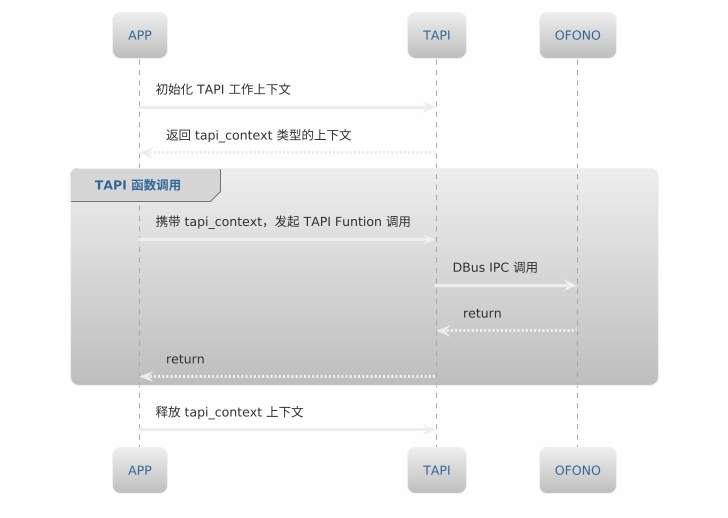

# Telephony 说明文档

[[English](./README.md)|简体中文]


## **概述**

Telephony 是 Vela 操作系统中用于处理电话和通信功能的框架和 API 集合。Framework/telephony 是 Vela 通信对应用层提供的接口层，又称为 TAPI（Telephony API）。

TAPI 提供了一组功能丰富的工具和接口，涵盖网络服务、通话服务、短信服务、数据服务、SIM 卡服务及其他相关功能。这些接口设计使得应用开发者无需深入了解 Telephony 的内部业务逻辑（Telephony 内部业务由 Ofono 实现），只需调用 API 即可轻松获取与 Telephony 相关的信息，完成应用开发。另外，Telephony 还支持灵活的扩展和定制，可满足不断变化的通信需求。


## **项目目录**
```tree
├── include
│   ├── tapi_call.h
│   ├── tapi_cbs.h
│   ├── tapi_data.h
│   ├── tapi.h
│   ├── tapi_ims.h
│   ├── tapi_manager.h
│   ├── tapi_network.h
│   ├── tapi_phonebook.h
│   ├── tapi_sim.h
│   ├── tapi_sms.h
│   ├── tapi_ss.h
│   └── tapi_stk.h
├── tapi_call.c
├── tapi_cbs.c
├── tapi_data.c
├── tapi_ims.c
├── tapi_manager.c
├── tapi_network.c
├── tapi_phonebook.c
├── tapi_sim.c
├── tapi_sms.c
├── tapi_ss.c
├── tapi_stk.c
├── tapi_utils.c
├── README.md
└── README_zh-cn.md
```

## **模块介绍**

| 模块     | 文件  | 说明      |
| :------ | :------- | :--------- |
| Common | tapi_manager.c/h  | <div style="width: 150pt">Telephony 公共服务接口 |
| Call | tapi_call.c/h | 通话服务接口|
| Call 补充服务 | tapi_ss.c/h | 通话补充服务接口|
| Network | tapi_network.c/h | 网络服务接口 |
| Data | tapi_data.c/h | 数据服务接口  |
| SIM | tapi_sim.c/h  |SIM 服务接口|
| STK | tapi_stk.c/h  |STK 服务接口|
| SMS | tapi_sms.c/h | 短信服务接口 |
| IMS | tapi_ims.c/h | IMS 服务接口  |
| Phonebook | tapi_phonebook.c/h | 电话簿接口  |
| <div style="width: 120pt">Telephony 工具类| tapi_utils.c/h | Telephony 工具类接口  |

### **功能介绍**

#### Common Api
- Telephony 服务接口：提供 Telephony 服务获取以及释放的接口。
- 获取通讯设备相关信息：如 IMEI、MODEL、MSISDN、PhoneNumber、Modem 参数等信息。
- 设备通讯能力管理：开启/关闭飞行模式、蜂窝通信能力等功能。

#### Call Api
- 电话状态监听：监听电话状态以及获取当前电话状态（摘机、来电、空闲三种状态）。
- 电话业务支持：支持来电接听、拨打电话、多路通话切换、挂断电话等功能。
- 紧急号码管理：获取当前所有紧急号码以及判断当前号码是否是紧急号码。

#### Call SS Api
- 通话补充业务支持：包括呼叫转移、呼叫等待、呼叫限制、隐藏本机号码、隐藏对方号码等。

#### Network Api
- 网络状态监听：监听网络状态以及获取语音/数据网络详细信息。
- 漫游控制：判断是否漫游以及漫游类型（国内漫游/国际漫游）。
- 小区信息管理：获取驻留小区信息、邻区小区信息等。

#### Data Api
- 数据状态监听：监听/去监听数据业务以及获取数据是否处于连接状态。
- APN 管理：加载 APN、添加 APN、移除 APN、重置 APN等。
- 数据业务控制：打开或关闭蜂窝数据、数据漫游等。

#### SIM Api
- SIM 状态监听：监听以及获取SIM卡状态。
- 获取 SIM 卡相关信息：如 ICCID、SIM 卡提供商、PIN 码等信息。
- SIM 卡设置：获取以及设置SIM卡启用/禁用状态。

#### STK Api
- 注册 STK 代理：用于 SIM 初始化过程中交互。
- 获取 STK 信息：如 STK 主菜单各菜单项、STK 主菜单标题、STK 文本内容等。
- 用户操作管理：请求用户确认启动浏览器、请求用户确认 SIM 卡通道建立、请求用户输入单个按键等。

#### IMS Api
- IMS 状态获取：获取 IMS 注册状态和服务状态以及监听 IMS 注册状态变化。
- IMS 开关控制：发起 IMS 请求、关闭 IMS 请求。
- IMS 能力设置：设置以及获取 IMS 服务能力，如 MSISDN。

#### Phonebook Api
- SIM 卡联系人管理：SIM 卡上的联系人进行增删改查的相关操作。

#### Utils Api
- 双向数据类型转换：Telephony 内部结构体参数与基本类型之间的双向转换，以满足不同数据处理需求。

## **TAPI 工作模型**



## **TAPI 代码演示**
### **使用步骤**
1. 调用 tapi_open 函数获取 tapi_context
```c
    tapi_context context;
    char* dbus_name = "vela.telephony.tool";
    context = tapi_open(dbus_name, on_tapi_client_ready, NULL);
```

2. 通过 tapi_context 传参到TAPI接口函数进行 Telephony 服务的操作
```c
    tapi_radio_state current = RADIO_STATE_UNAVAILABLE;
    tapi_get_radio_state(t_context, get_used_slot_id(), &current);
```

3. 调用 tapi_close 函数释放 tapi_context
```c
    tapi_close(context);
```

### **完整示例代码**
```c
int main(int argc, char* argv[])
{
    tapi_context context;
    char* dbus_name = "vela.telephony.tool";

    // 调用 Telephony 服务，获取 tapi_context
    context = tapi_open(dbus_name, on_tapi_client_ready, NULL);

    // 调用 TAPI 接口函数：tapi_get_radio_state，该函数用来获取当前手机的 radio 状态
    tapi_radio_state current = RADIO_STATE_UNAVAILABLE;
    int ret = tapi_get_radio_state(t_context, get_used_slot_id(), &current);

    // 调用成功
    if (ret == 0) {
        log_i("radio state_changed, radio_state = %d", current);
        current_radio_state = current;
    // 调用失败
    } else {
        log_e("Radio state error, ret = %d, state = %d", ret, current);
    }

    // 释放 tapi_context
    tapi_close(context);

    return 0;
}
```
